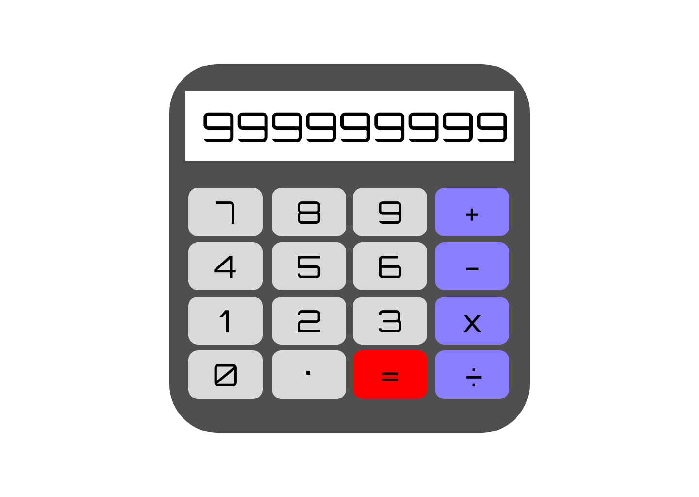

# Demo Simple Calculator
## Description
This is a website that holds a simple 4-function calculator that was made to practice the basic principles of web design and development. This project should be extremely similar to a basic calculator that one should be able to pick up at the Dollar Store. 

Users should be able to do the following:
- Perform simple addition, subtraction, multiplication, and division between 2 or more numbers
- See the numbers they input on the display screen
- See the result of whatever operation on the display screen

## Access
You can access this simple calculator with the following link: [Simple Calculator](https://k0j05ar3.github.io/calculator)

## Contributions
I am using skills that I learned from [W3Schools](https://www.w3schools.com) and [MDN Docs](https://developer.mozilla.org/en-US/)

## Licenses
No licenses were added.